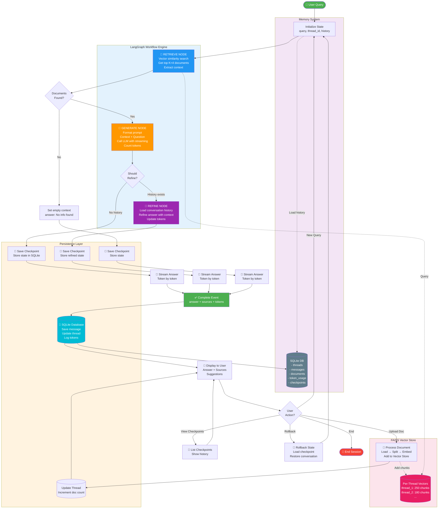

```mermaid
graph TB
    Start([🚀 User Query]) --> Init[Initialize State<br/>query, thread_id, history]
    
    Init --> Retrieve[🔹 RETRIEVE NODE<br/>Vector similarity search<br/>Get top K=4 documents<br/>Extract context]
    
    Retrieve --> CheckDocs{Documents<br/>Found?}
    
    CheckDocs -->|No| NoContext[Set empty context<br/>answer: No info found]
    CheckDocs -->|Yes| Generate[🔹 GENERATE NODE<br/>Format prompt<br/>Context + Question<br/>Call LLM with streaming<br/>Count tokens]
    
    Generate --> RefineCheck{Should<br/>Refine?}
    
    RefineCheck -->|History exists| Refine[🔹 REFINE NODE<br/>Load conversation history<br/>Refine answer with context<br/>Update tokens]
    
    RefineCheck -->|No history| SaveState1[💾 Save Checkpoint<br/>Store state in SQLite]
    
    Refine --> SaveState2[💾 Save Checkpoint<br/>Store refined state]
    
    NoContext --> SaveState3[💾 Save Checkpoint<br/>Store state]
    
    SaveState1 --> Stream1[📡 Stream Answer<br/>Token by token]
    SaveState2 --> Stream2[📡 Stream Answer<br/>Token by token]
    SaveState3 --> Stream3[📡 Stream Answer<br/>Token by token]
    
    Stream1 --> Complete
    Stream2 --> Complete
    Stream3 --> Complete
    
    Complete[✅ Complete Event<br/>answer + sources + tokens] --> SaveDB[(💾 SQLite Database<br/>Save message<br/>Update thread<br/>Log tokens)]
    
    SaveDB --> Display[💬 Display to User<br/>Answer + Sources<br/>Suggestions]
    
    Display --> NextAction{User<br/>Action?}
    
    NextAction -->|New Query| Init
    NextAction -->|Upload Doc| ProcessDoc[📄 Process Document<br/>Load → Split → Embed<br/>Add to Vector Store]
    NextAction -->|View Checkpoints| Checkpoints[📜 List Checkpoints<br/>Show history]
    NextAction -->|Rollback| Rollback[🔄 Rollback State<br/>Load checkpoint<br/>Restore conversation]
    NextAction -->|End| End([👋 End Session])
    
    ProcessDoc --> UpdateThread[(Update Thread<br/>Increment doc count)]
    UpdateThread --> Display
    
    Checkpoints --> Display
    Rollback --> Init
    
    subgraph LangGraph_Workflow [LangGraph Workflow Engine]
        Retrieve
        Generate
        Refine
        RefineCheck
    end
    
    subgraph Persistence_Layer [Persistence Layer]
        SaveState1
        SaveState2
        SaveState3
        SaveDB
        UpdateThread
    end
    
    subgraph Vector_Store [FAISS Vector Store]
        VS[(Per-Thread Vectors<br/>thread_1: 250 chunks<br/>thread_2: 180 chunks<br/>...)]
        ProcessDoc -.->|Add chunks| VS
        Retrieve -.->|Query| VS
    end
    
    subgraph Memory_System [Memory System]
        SQLite[(SQLite DB<br/>- threads<br/>- messages<br/>- documents<br/>- token_usage<br/>- checkpoints)]
        SaveDB --> SQLite
        Init -.->|Load history| SQLite
    end
    
    style Start fill:#4caf50,color:#fff
    style End fill:#f44336,color:#fff
    style Retrieve fill:#2196f3,color:#fff
    style Generate fill:#ff9800,color:#fff
    style Refine fill:#9c27b0,color:#fff
    style Complete fill:#4caf50,color:#fff
    style SaveDB fill:#00bcd4,color:#fff
    style VS fill:#e91e63,color:#fff
    style SQLite fill:#607d8b,color:#fff
    style LangGraph_Workflow fill:#e3f2fd
    style Persistence_Layer fill:#fff3e0
    style Vector_Store fill:#fce4ec
    style Memory_System fill:#f3e5f5
```